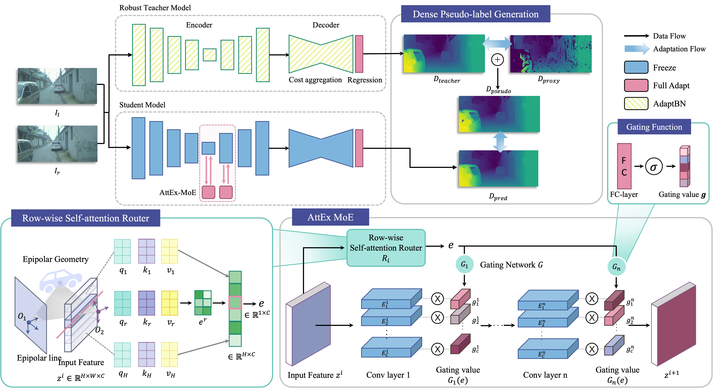

# RobIA: Robust Instance-aware Continual Test-time Adaptation for Deep Stereo [NeurIPS 2025]


[](https://arxiv.org/abs/2511.10107)

Authors: [Jueun Ko](https://github.com/0ju-un)\*, [Hyewon Park](https://github.com/hhhyyeee)\*, [Hyesong Choi](https://github.com/doihye), Dongbo Min (\* denotes equal contribution)

This repository is official code of **"RobIA: Robust Instance-aware Continual Test-time Adaptation for Deep Stereo"**, *NeurIPS 2025*


## 🎬 Overview


RobIA performs **Continual Test-Time Adaptation (CTTA)** for deep stereo matching, adapting a pretrained stereo network online as it encounters a stream of shifting target domains (e.g. dusky → rainy → night) without access to ground truth. It introduces two components:

- 🔍 **Attend-and-Excite Mixture-of-Experts (AttEx-MoE)** — a parameter-efficient module that dynamically routes input to frozen experts via lightweight self-attention mechanism.

- 🧑‍🏫 **Robust AdaptBN Teacher** — a teacher model that provides dense pseudo-supervision by complementing sparse handcrafted labels.

## 📑 Table of Contents

1. [Installation](#-installation)
2. [Data Preparation](#-data-preparation)
3. [Pretrained Weights](#-pretrained-weights)
4. [Running Adaptation](#-running-adaptation)
   - [Quick Start](#quick-start)
5. [Results](#-results)
6. [Citation](#-citation)
7. [Acknowledgements](#-acknowledgements)


## 🛠️ Installation

Our code has been tested with **Python 3.8**, **PyTorch 1.11.0 (CUDA 10.2)**, and **timm 0.6.5**.

Core dependencies

```text
timm==0.6.5
webdataset==0.2.60
opencv-python==4.11.0.86
mmcv==1.7.2
openmim==0.3.9
more-itertools==10.5.0
```

> **Note:** the AttEx-MoE backbone is built on top of `timm`'s MobileNetV2 implementation, so **`timm==0.6.5`** is required — other versions may change layer/parameter naming and break checkpoint loading.

## 🗄️ Data Preparation

We follow the pre-processing pipeline of [FedStereo](https://github.com/mattpoggi/fedstereo): each sequence is packed into a WebDataset `.tar` archive.
```
<datapath>/
├── drivingstereo/ 
    ├── 2018-08-17-09-45.tar
    ├── ...
...
```

Set the data root in your config file:

```ini
[environment]
datapath = /path/to/datapath/
```

<!-- TODO: add direct download links / paths if you host the archives yourself. -->

We reuse the **proxy labels and `.tar` pre-processing pipeline from [FedStereo](https://github.com/mattpoggi/fedstereo)** — please follow their [data preparation instructions](https://github.com/mattpoggi/fedstereo#-data-pre-processing) to download the proxy labels and build the per-sequence archives, then point `datapath` to the resulting folder.
The mapping from a dataset to its sub-domains (and their order) is defined in `clients.py`:


## 📥 Pretrained Weights

RobIA builds on the [CoEx](https://github.com/antabangun/coex) stereo backbone and adapts it at test time. Two checkpoints are required: a student model and a Robust AdaptBN teacher model.

weights download: [Google Drive](https://drive.google.com/drive/folders/1KNxzcVkIUbnLw7PnChT0u2gRg4HUWO9p?usp=drive_link)

```
weights/
├── robia_attex_moe.ckpt    # set in [network] checkpoint
└── coex.ckpt    # set in [network] teacher_checkpoint
```
`config.ini`
```ini
[network]
checkpoint         = weights/robia_attex_mo.ckpt
teacher_checkpoint = weights/coex.ckpt
```

## 📝 Running Adaptation

### Quick Start

A single GPU is sufficient. Run continual test-time adaptation with:

```bash
python run.py --cfg cfgs/config.ini
```


## 📊 Results

<!-- TODO: add your main results table(s). Example skeleton: -->
**Performance on DrivingStereo**

| Method | Round 1 (D1-all ↓) | Round 10 (D1-all ↓) | **overall (D1-all ↓)** |
| ------ | -------------- | ------------- |  ------------- | 
| Source (no adapt.) |    5.56   |       5.56    |      5.56     |
| RobIA  |     3.75     |   2.57     |      2.77     |

## 📌 Citation

If you find this work useful, please consider citing😻:

```bibtex
@article{ko2026robia,
  title={RobIA: Robust instance-aware continual test-time adaptation for deep stereo},
  author={Ko, Jueun and Park, Hyewon and Choi, Hyesong and Min, Dongbo},
  journal={Advances in Neural Information Processing Systems},
  volume={38},
  pages={46477--46503},
  year={2026}
}
```

<!-- TODO: replace with the official NeurIPS proceedings entry once available. -->

## 🙏 Acknowledgements

This codebase builds upon [FedStereo](https://github.com/mattpoggi/fedstereo) and [CoEx](https://github.com/antabangun/coex). We thank the authors for releasing their code.


<!-- TODO: add a contact email if you'd like. -->
